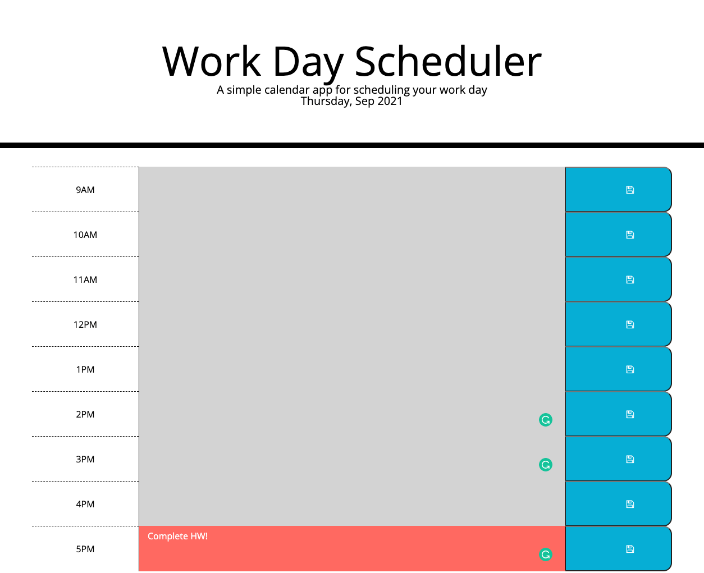

# HOMEWORK5_DAY_PLANNER
# Description
- This assigment was to create a daily planner which included:
1. color coded time slots
    - current hour: red
    - past hour: grey
    - future hour: green
2. user input in the text area (middle column) can be saved
    - using local storage data saved will remain presented if the user refreshes the browser

# link
https://christa-baccas.github.io/HOMEWORK5_DAY_PLANNER/

# ScreenShot

# Help / Assistance
- Tutor
- Study Group Session
- AskBCS
